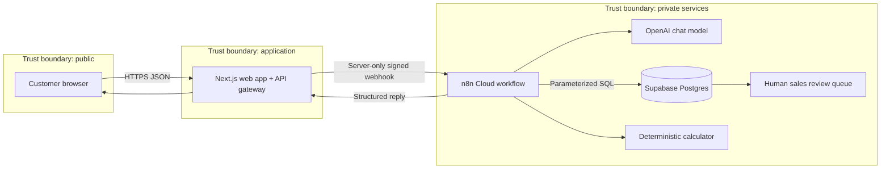

# Sia Huat Phase 1 Architecture

## Decision

Phase 1 uses n8n Cloud as the orchestration layer and Supabase Postgres as the only catalogue source of truth. The Next.js application is a backend-for-frontend: the browser never receives an n8n secret, OpenAI key, Supabase password, or database connection string.

## Responsibilities

| Component | Owns | Must not own |
| --- | --- | --- |
| Browser | Chat UI, local transcript, generated session ID | API keys, database credentials, trusted prices or totals |
| Next.js | Input validation, deterministic high-confidence intents, constrained catalogue lookup, secret webhook header, response validation, user-safe errors | AI prompts, unverified catalogue facts, database owner credentials |
| n8n | Conversation state, tool orchestration, structured response, explicit review workflow | Unverified catalogue facts or free-form arithmetic |
| OpenAI | Intent detection, clarification, conversational wording, tool choice | Product truth, pricing truth, totals, order confirmation |
| Supabase | Products, prices, status, UOM, enquiry/review records | Conversation phrasing |
| Calculator | `quantity × list_price` using numeric inputs | Product lookup or conversational decisions |

## Request lifecycle

1. The browser sends `sessionId`, `message`, limited chat history, and an optional image to `POST /api/chat`.
2. Next.js validates input. Deterministic conversational intents and tightly constrained catalogue searches are handled locally; open-ended requests call the secured n8n webhook. `N8N_WORKFLOW_KEY` remains server-only.
3. n8n gives the message to the AI agent with session memory.
4. When catalogue facts are needed, the agent calls `search_catalogue`. The Postgres node uses a parameterized call to `public.search_products($1, 5)`.
5. The agent may state only the returned product fields.
6. After a product is selected, the agent asks for quantity. The calculator tool computes the total; the model does not perform arithmetic.
7. n8n returns a fixed JSON contract: `message`, `stage`, `products`, `selectedProduct`, and `suggestions`. `stage` can become `submitted` only after the database confirms the review record.
8. Submission is idempotent for the same session, SKU, and quantity. A quote remains an estimate until a human sales reviewer approves it. No customer message or order is sent automatically.

## Image identification

Supplier image filenames often contain a stock ID. The API extracts that
identifier, verifies it against Supabase, and labels the result as filename
metadata rather than OCR. Exact identifiers can select one catalogue item;
partial identifiers return only matching variants for customer confirmation.

When a filename does not contain a usable identifier, n8n remains responsible
for visual recognition and OCR. Visual similarity alone must never be presented
as an exact SKU match. Product name, SKU, price, status and UOM become trusted
only after Supabase returns the corresponding catalogue row.

## Security model

- The public browser calls only the Next.js API.
- n8n webhook authentication is stored in `N8N_WORKFLOW_KEY` and sent only by the server.
- OpenAI and Postgres credentials live in n8n credentials, not workflow JSON.
- Catalogue SQL is parameterized and result limits are enforced in the database function.
- `products` and `enquiries` have RLS enabled and are not granted to `anon` or `authenticated`.
- The production n8n database credential should use a dedicated least-privilege login. It needs only `SELECT` on products, `EXECUTE` on `search_products`, and the minimum enquiry permissions required by the review workflow.
- Before an internet-facing demo, add durable rate limiting to `/api/chat`, request-size limits at the host, secret rotation, and alerting for n8n/OpenAI errors.

## Data ownership

The cleaned workbook is an import source, not the live database. Supabase becomes authoritative after import. Every catalogue refresh should be repeatable, validated by row/status totals, and logged with its source date.

The current catalogue contains 39,249 unique products. The earlier expectation of roughly 140,000 SKUs must be reconciled with the supplier before production; the application must not imply the imported file is complete.

## Phase 1 completion boundary

Implemented:

- Responsive web chat UI.
- Next.js server gateway with request and response validation.
- Secured n8n production webhook.
- OpenAI conversation and session memory.
- Supabase-backed product search.
- Deterministic quote calculation.
- Idempotent human-review submission with database-calculated quote snapshots.
- Dedicated least-privilege n8n database login.
- Human-review wording and no automatic customer delivery.

Still required before a customer-facing release:

- Add a reviewer screen or notification workflow with approve/reject actions.
- Add durable rate limiting and basic observability.
- Rotate credentials that were exposed during setup.
- Reconcile the 39,249 imported products against the stated 140,000-SKU scope.

## Later WhatsApp architecture

WhatsApp should become another channel adapter into the same n8n workflow. It should not contain catalogue or pricing logic. The same Supabase tools, structured response contract, quote rules, and human-review gate should serve both the web demo and WhatsApp.
